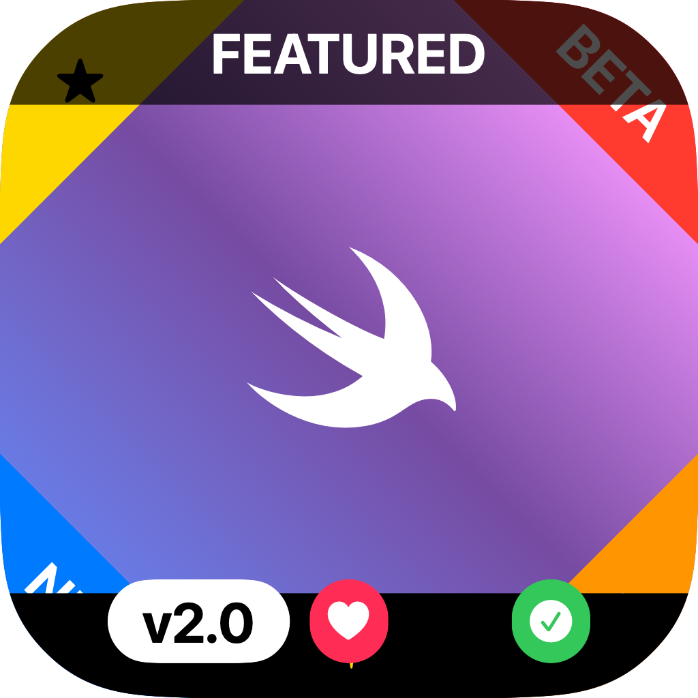

# icon-generator

A Swift CLI tool for generating app icons with squircle shapes, labels, and SF Symbols. Outputs single PNGs, SVGs, or complete Xcode `.appiconset` bundles.

## Installation

```bash
swift build -c release
cp .build/release/icon-generator /usr/local/bin/
```

## Examples

| Command | Result |
|---------|--------|
| `icon-generator --background "#3366FF"` |  |
| `icon-generator --background "linear-gradient(to bottom, #FF6600, #CC0066)"` |  |
| `icon-generator --background "radial-gradient(#FFCC00, #FF6600)"` |  |
| `icon-generator --background "angular-gradient(red, orange, yellow, green, blue, purple, red)"` |  |
| `icon-generator --background "#3366FF" --center "A" --center-color "#FFFFFF" --center-size 0.6` |  |
| `icon-generator --background "#3366FF" --center "sf:swift" --center-color "#FFFFFF"` |  |
| `icon-generator --background "#3366FF" --label "topRight:BETA:#FF0000:#FFFFFF"` |  |
| `icon-generator --background "#3366FF" --label "pillCenter:v2.0:#FFFFFF:#000000"` |  |
| `icon-generator --background "#3366FF" --corner-style rounded` |  |
| `icon-generator --kitchen-sink` |  |

## Options

| Option | Default | Description |
|--------|---------|-------------|
| `-o, --output` | `icon.png` | Output path (`.png`, `.svg`, or `.appiconset`) |
| `--background` | `white` | Background color or gradient |
| `--size` | `1024` | Size in pixels (single image only) |
| `--corner-style` | `squircle` | `none`, `rounded`, or `squircle` |
| `--corner-radius` | `0.2237` | Radius ratio (0.0-0.5) |
| `--center` | - | Center content (text, `sf:symbol`, or `@path`) |
| `--center-color` | `black` | Center content color |
| `--center-size` | `0.5` | Center size ratio (0.0-1.0) |
| `--center-rotation` | `0` | Rotation in degrees |
| `--label` | - | Label spec (repeatable, see below) |
| `--platform` | `ios` | For `.appiconset`: `ios`, `macos`, `watchos`, `universal` |
| `-c, --config` | - | JSON config file |
| `--kitchen-sink` | - | Demo icon with all features |
| `--random` | - | Random icon configuration |

## Labels

Format: `position:content[:background[:foreground[:options]]]`

**Positions:**
- Corner ribbons: `topLeft`, `topRight`, `bottomLeft`, `bottomRight`
- Edge ribbons: `top`, `bottom`, `left`, `right`
- Bottom pills: `pillLeft`, `pillCenter`, `pillRight`

**Content:** Text, `sf:symbol.name`, or `@/path/to/image.png`

**Options:** `norotate` (keeps content upright on diagonal ribbons)

```bash
--label "topRight:BETA"
--label "topRight:BETA:#FF0000:#FFFFFF"
--label "topRight:sf:star.fill:#FFD700:#000"
--label "topRight:sf:star.fill:#FFD700:#000:norotate"
--label "pillCenter:v2.0:#FFFFFF:#000000"
```

## Gradients

```bash
# Linear
--background "linear-gradient(to bottom, red, blue)"
--background "linear-gradient(45deg, #FF6600, #CC0066)"

# Radial
--background "radial-gradient(#FFCC00, #FF6600)"

# Angular/Conic
--background "angular-gradient(red, orange, yellow, green, blue, purple, red)"
```

## Colors

Supports hex (`#RGB`, `#RRGGBB`, `#RRGGBBAA`), named colors (`red`, `steelblue`), and CSS functions (`rgb()`, `rgba()`).

## App Icon Sets

```bash
# iOS (1024px)
icon-generator -o AppIcon.appiconset --platform ios --background "#007AFF"

# macOS (16-1024px, all sizes)
icon-generator -o AppIcon.appiconset --platform macos --background "#F05138"
```

## JSON Config

```json
{
  "background": "linear-gradient(135deg, #667eea, #764ba2)",
  "output": "icon.png",
  "labels": [
    {"position": "topRight", "content": "BETA", "background-color": "#FF0000"}
  ],
  "center": {
    "content": "sf:swift",
    "color": "#FFFFFF",
    "size": 0.5
  }
}
```

```bash
icon-generator --config icon.json
```

Use `--dump-config` to output the resolved configuration as JSON without generating an image. This is useful for creating a config file from CLI arguments:

```bash
# Generate a config file from CLI options
icon-generator --background "#3366FF" --center "sf:swift" --label "topRight:BETA" --dump-config > icon.json

# See what --kitchen-sink or --random produce
icon-generator --kitchen-sink --dump-config
icon-generator --random --dump-config
```

## License

MIT
