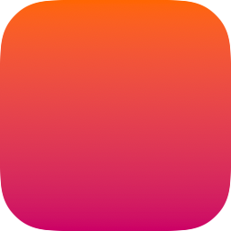
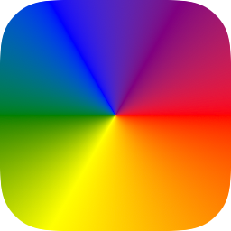
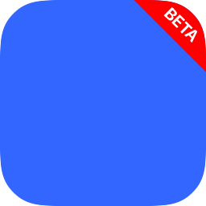
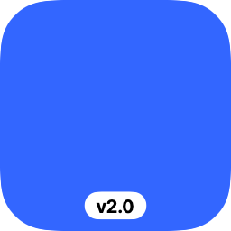
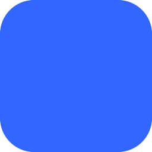

# icon-generator

A Swift CLI tool for generating app icons with squircle shapes, labels, and SF Symbols. Outputs single PNGs, SVGs, or complete Xcode `.appiconset` bundles.

## Installation

```bash
swift build -c release
cp .build/release/icon-generator /usr/local/bin/
```

## Examples

| Command | Result |
|---------|--------|
| `icon-generator --background "#3366FF"` |  |
| `icon-generator --background "linear-gradient(to bottom, #FF6600, #CC0066)"` |  |
| `icon-generator --background "radial-gradient(#FFCC00, #FF6600)"` |  |
| `icon-generator --background "angular-gradient(red, orange, yellow, green, blue, purple, red)"` |  |
| `icon-generator --background "#3366FF" --layer "center:A:color=#FFFFFF:size=0.6"` |  |
| `icon-generator --background "#3366FF" --layer "center:sf:swift:color=#FFFFFF"` |  |
| `icon-generator --background "#3366FF" --layer "topRight:BETA:bg=#FF0000"` |  |
| `icon-generator --background "#3366FF" --layer "pillCenter:v2.0:bg=#FFFFFF:fg=#000000"` |  |
| `icon-generator --background "#3366FF" --corner-style rounded` |  |

## Options

| Option | Default | Description |
|--------|---------|-------------|
| `-o, --output` | `icon.png` | Output path (`.png`, `.svg`, or `.appiconset`) |
| `--background` | `white` | Background color or gradient |
| `--size` | `1024` | Size in pixels (single image only) |
| `--corner-style` | `squircle` | `none`, `rounded`, or `squircle` |
| `--corner-radius` | `0.2237` | Radius ratio (0.0-0.5) |
| `--layer` | - | Layer spec (repeatable, see below) |
| `--platform` | `ios` | For `.appiconset`: `ios`, `macos`, `watchos`, `universal` |
| `-c, --config` | - | JSON config file |
| `--kitchen-sink` | - | Demo icon with all features |
| `--random` | - | Random icon configuration |

## Layers

Format: `position:content[:key=value...]`

**Positions:**
- `center` - Center content
- Corner ribbons: `topLeft`, `topRight`, `bottomLeft`, `bottomRight`
- Edge ribbons: `top`, `bottom`, `left`, `right`
- Bottom pills: `pillLeft`, `pillCenter`, `pillRight`

**Content:** Text, `sf:symbol.name`, or `@/path/to/image.png`

**Options (key=value):**
- `color` or `fg` - Foreground color
- `bg` - Background color (labels only)
- `size` - Size ratio 0.0-1.0 (center only)
- `norotate` - Don't rotate content (diagonal labels)

```bash
# Center content
--layer "center:sf:swift:color=#FFFFFF:size=0.5"
--layer "center:A:color=#FFFFFF:size=0.6"

# Labels
--layer "topRight:BETA:bg=#FF0000"
--layer "topRight:sf:star.fill:bg=#FFD700:norotate"
--layer "pillCenter:v2.0:bg=#FFFFFF:fg=#000000"
```

## Gradients

```bash
# Linear
--background "linear-gradient(to bottom, red, blue)"
--background "linear-gradient(45deg, #FF6600, #CC0066)"

# Radial
--background "radial-gradient(#FFCC00, #FF6600)"

# Angular/Conic
--background "angular-gradient(red, orange, yellow, green, blue, purple, red)"
```

## Colors

Supports hex (`#RGB`, `#RRGGBB`, `#RRGGBBAA`), named colors (`red`, `steelblue`), and CSS functions (`rgb()`, `rgba()`).

## App Icon Sets

```bash
# iOS (1024px)
icon-generator -o AppIcon.appiconset --platform ios --background "#007AFF"

# macOS (16-1024px, all sizes)
icon-generator -o AppIcon.appiconset --platform macos --background "#F05138"
```

## JSON Config

```json
{
  "background": {
    "type": "linear",
    "colors": ["#667eea", "#764ba2"],
    "angle": 135
  },
  "output": "icon.png",
  "layers": [
    {
      "position": "center",
      "symbol": "swift",
      "color": "#FFFFFF",
      "size": 0.5
    },
    {
      "position": "topRight",
      "text": "BETA",
      "background-color": {
        "type": "linear",
        "colors": ["#FF3B30", "#FF9500"],
        "angle": 45
      }
    },
    {"position": "topLeft", "symbol": "star.fill", "background-color": "#FFD700"}
  ]
}
```

### Layer Positions
- `center` - Center content (text, symbol, or image)
- Label positions: `top`, `bottom`, `left`, `right`, `topLeft`, `topRight`, `bottomLeft`, `bottomRight`, `pillLeft`, `pillCenter`, `pillRight`

### Content Keys
- `text` - Plain text string
- `symbol` - SF Symbol name (without `sf:` prefix)
- `image` - Path to image file (without `@` prefix)

### Background/Color Values
Solid colors can be specified as strings (`"#FF0000"`, `"red"`).

Gradients use structured objects:

```json
// Linear gradient
{
  "type": "linear",
  "colors": ["#FF0000", "#0000FF"],
  "angle": 45
}

// Radial gradient
{
  "type": "radial",
  "colors": ["#FFCC00", "#FF6600"],
  "center": [0.5, 0.5],
  "start-radius": 0,
  "end-radius": 0.7
}

// Angular/conic gradient
{
  "type": "angular",
  "colors": ["red", "orange", "yellow", "green", "blue", "purple", "red"],
  "center": [0.5, 0.5],
  "angle": 0
}
```

```bash
icon-generator --config icon.json
```

Use `--dump-config` to output the resolved configuration as JSON without generating an image. This is useful for creating a config file from CLI arguments:

```bash
# Generate a config file from CLI options
icon-generator --background "#3366FF" --center "sf:swift" --label "topRight:BETA" --dump-config > icon.json

# See what --kitchen-sink or --random produce
icon-generator --kitchen-sink --dump-config
icon-generator --random --dump-config
```

## Full Help

```
OVERVIEW: Generate a squircle icon as a PNG image or Xcode app icon set

Options can be specified via CLI arguments or a JSON config file.
CLI arguments override config file values.

Output Formats:
  - Single PNG: --output icon.png
  - Single SVG: --output icon.svg
  - App Icon Set: --output AppIcon.appiconset --platform ios

App Icon Platforms:
  ios        Single 1024x1024 icon for iOS/iPadOS
  macos      Multiple sizes (16-1024) for macOS
  watchos    Single 1024x1024 icon for watchOS
  universal  Combined iOS + macOS icons

Corner Styles:
  none      Square corners (no rounding)
  rounded   Standard rounded corners (circular arcs)
  squircle  Continuous corners (iOS-style, default)

JSON Config Example:
  {
    "background": {"type": "linear", "colors": ["#667eea", "#764ba2"], "angle": 135},
    "output": "icon.png",
    "size": 1024,
    "corner-style": "squircle",
    "corner-radius": 0.2237,
    "layers": [
      {"position": "center", "symbol": "swift", "color": "#FFFFFF", "size": 0.5},
      {"position": "topRight", "text": "BETA", "background-color": "#FF0000"},
      {"position": "pillCenter", "symbol": "star.fill", "foreground-color": "#FFD700"}
    ]
  }

Layer positions:
  "center"     Center content (uses color, size, alignment, anchor, y-offset)
  Labels       top, bottom, left, right, topLeft, topRight, bottomLeft,
               bottomRight, pillLeft, pillCenter, pillRight
               (use background-color, foreground-color, rotate-content)

JSON content keys (use one per layer):
  "text": "BETA"           Plain text
  "symbol": "star.fill"    SF Symbol name
  "image": "/path/to.png"  Image file path

JSON gradient backgrounds:
  Solid:   "#FF0000" or "red"
  Linear:  {"type": "linear", "colors": [...], "angle": 45}
  Radial:  {"type": "radial", "colors": [...]}
  Angular: {"type": "angular", "colors": [...]}

Labels can be added using the --label option (repeatable).

Label format: position:content[:backgroundColor[:foregroundColor]]

Positions:
  Edge ribbons:    top, bottom, left, right
  Corner ribbons:  topLeft, topRight, bottomLeft, bottomRight
  Bottom pills:    pillLeft, pillCenter, pillRight

Content:
  Text:      Just the text string (e.g., "BETA")
  Image:     Prefix with @ (e.g., "@/path/to/icon.png")
  SF Symbol: Prefix with sf: (e.g., "sf:star.fill")

Colors: Hex format (e.g., #FF0000)
Defaults: backgroundColor=#FF0000 (red), foregroundColor=#FFFFFF (white)

Center content can be added with --center:
  --center "Hello"              Text with default color (#000000) and size (0.5)
  --center "@/path/to/img.png"  Image file
  --center "sf:star.fill"       SF Symbol

Examples:
  icon-generator --background "#3366FF" -o icon.png
  icon-generator --background "#3366FF" -o icon.svg
  icon-generator -o AppIcon.appiconset --platform ios --background "#FF0000"
  icon-generator -o AppIcon.appiconset --platform macos --center "sf:swift"
  icon-generator --config config.json
  --label topRight:BETA
  --center "sf:swift" --center-color "#F05138"

USAGE: icon-generator <options>

OPTIONS:
  -c, --config <config>   Path to JSON configuration file
  --background <background>
                          Background color or gradient (e.g., #FF0000,
                          linear-gradient(to bottom, red, blue))
  -o, --output <output>   Output file path
  --size <size>           Image size in pixels
  --corner-style <corner-style>
                          Corner style: none, rounded, or squircle
  --corner-radius <corner-radius>
                          Corner radius ratio (0.0 to 0.5)
  --platform <platform>   App icon platform: ios, macos, watchos, or universal
  --label <label>         Label specification (repeatable)
  --center <center>       Center content (text, @image path, or sf:symbol)
  --center-color <center-color>
                          Center content color in hex format
  --center-size <center-size>
                          Center content size ratio (0.0 to 1.0)
  --center-align <center-align>
                          Center alignment mode: visual or typographic
  --center-anchor <center-anchor>
                          Center vertical anchor: baseline, cap, or center
  --center-y-offset <center-y-offset>
                          Center vertical offset ratio (-1.0 to 1.0)
  --center-rotation <center-rotation>
                          Center rotation in degrees (positive = clockwise)
  --svg-font <svg-font>   Font family for SVG text (default: system fonts)
  --dump-config           Output resolved configuration as JSON (no image generated)
  --random                Generate random icon configuration
  --kitchen-sink          Generate an icon using every feature (kitchen sink demo)
  -h, --help              Show help information.
```

## License

MIT
